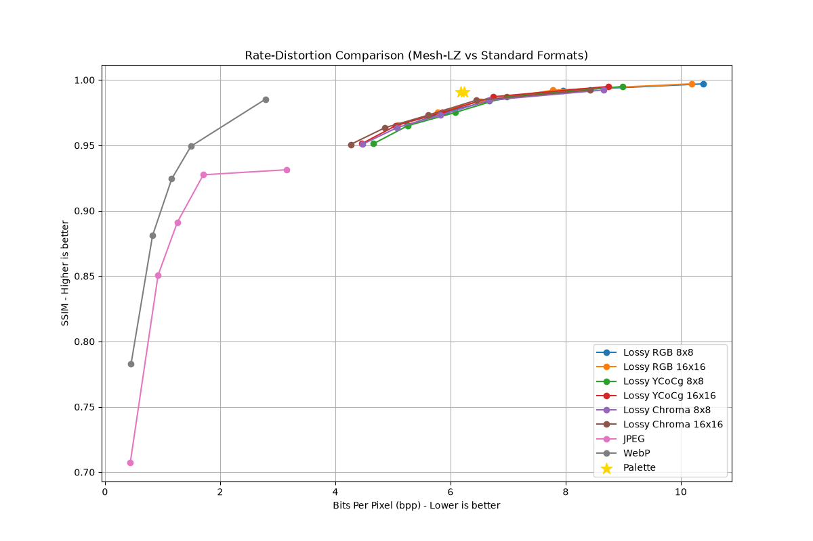

# Mesh-LZ Image Codec

Mesh-LZ is a custom image compression format written in Rust, featuring an Interleaved rANS entropy coder. It supports highly efficient lossless compression as well as several lossy quantization and color-subsampling modes, making it highly competitive with PNG and JPEG.

## Setup & Installation

Ensure you have Rust and Cargo installed.

```bash
# Clone the repository
git clone https://github.com/chris6676776/mesh-lz-image.git
cd newform

# Build the release binary
Mesh-LZ includes a hardware-accelerated desktop application to visually compress and compare images.

```bash
cargo run --release --bin mesh_lz_codec
```

# Run the CLI
target/release/mesh_lz_codec.exe --help
```


### Running the Web GUI Dashboard
Mesh-LZ includes a visual browser dashboard to interactively compress and view images.
```bash
cargo run --release --bin mesh_lz_codec -- gui --port 8080
```

---

## Compression Modes

Mesh-LZ supports multiple modes to give you fine-grained control over the Rate-Distortion tradeoff.

### 1. Lossless Mode (Default)
**Command:** `mesh_lz_codec compress -i in.png -o out.mlz -q 100 -b 16`
The default mode (quality 100) provides mathematically lossless compression. In benchmarking, Mesh-LZ 16x16 achieves **11.5 bpp**, outperforming standard PNG (15.3 bpp) by roughly 25%.

### 2. Lossy RGB (Quantization)
**Command:** `mesh_lz_codec compress -i in.png -o out.mlz -q <1-99>`
Applies pure scalar quantization to the spatial residuals or frequency domain. Lower quality values yield smaller files.

### 3. Palette Mode (NeuQuant)
**Command:** `mesh_lz_codec compress -i in.png -o out.mlz --palette`
Reduces the 24-bit TrueColor image down to an optimized 8-bit (256 color) palette before lossless encoding. This is highly efficient for graphics but introduces lossy color banding in photographs.

### 4. YCoCg-R Color Decorrelation
**Command:** `mesh_lz_codec compress -i in.png -o out.mlz -y -q <1-99>`
Instead of compressing in RGB, the image is converted to the reversible YCoCg-R color space. This separates brightness (Luma) from color (Chroma), which typically compresses much better mathematically.

### 5. Chroma Subsampling (YCoCg 4:2:0)
**Command:** `mesh_lz_codec compress -i in.png -o out.mlz -y -s -q <1-99>`
The ultimate mode for web compression. Human eyes are less sensitive to color resolution than brightness. This mode preserves full brightness detail but discards 75% of the color resolution. It drastically reduces file size with minimal visual impact.

---

### Rate-Distortion Curve
*(Note: Plot generated locally via the benchmarking script)*



### Benchmark Data Table


| Group | Name | BPP | File Size (Bytes) | SSIM | Enc (ms) | Dec (ms) |
|-------|------|-----|-------------------|------|----------|----------|
| Lossless | MLZ 8x8 | 11.706 | 575352 | 1.0000 | 152.7 | 98.8 |
| Lossless | MLZ 16x16 | 11.518 | 566115 | 1.0000 | 219.9 | 107.9 |
| Lossless | WebP Lossless | 10.223 | 502480 | 1.0000 | 398.9 | 21.9 |
| Lossless | PNG | 15.339 | 753927 | 1.0000 | 51.2 | 13.8 |
| Palette | MLZ 8x8 | 6.240 | 306696 | 0.9906 | 229.8 | 108.4 |
| Palette | MLZ 16x16 | 6.179 | 303709 | 0.9906 | 253.5 | 93.3 |
| Lossy RGB 8x8 | q=10 | 5.249 | 258016 | 0.9655 | 161.7 | 99.3 |
| Lossy RGB 8x8 | q=30 | 5.927 | 291302 | 0.9758 | 161.3 | 97.2 |
| Lossy RGB 8x8 | q=50 | 6.673 | 328010 | 0.9838 | 179.9 | 111.4 |
| Lossy RGB 8x8 | q=70 | 7.948 | 390677 | 0.9921 | 165.8 | 103.2 |
| Lossy RGB 8x8 | q=90 | 10.386 | 510489 | 0.9970 | 256.8 | 182.4 |
| Lossy RGB 16x16 | q=10 | 5.086 | 249966 | 0.9655 | 260.3 | 82.8 |
| Lossy RGB 16x16 | q=30 | 5.782 | 284175 | 0.9755 | 250.2 | 91.6 |
| Lossy RGB 16x16 | q=50 | 6.520 | 320489 | 0.9838 | 238.2 | 103.2 |
| Lossy RGB 16x16 | q=70 | 7.777 | 382271 | 0.9921 | 227.4 | 97.8 |
| Lossy RGB 16x16 | q=90 | 10.191 | 500890 | 0.9970 | 255.4 | 130.7 |
| Lossy YCoCg 8x8 | q=10 | 4.666 | 229326 | 0.9513 | 241.1 | 109.3 |
| Lossy YCoCg 8x8 | q=30 | 5.257 | 258376 | 0.9650 | 181.0 | 143.4 |
| Lossy YCoCg 8x8 | q=50 | 6.086 | 299129 | 0.9752 | 196.0 | 105.2 |
| Lossy YCoCg 8x8 | q=70 | 6.980 | 343060 | 0.9872 | 172.2 | 87.3 |
| Lossy YCoCg 8x8 | q=90 | 8.994 | 442053 | 0.9950 | 176.7 | 93.5 |
| Lossy YCoCg 16x16 | q=10 | 4.464 | 219390 | 0.9513 | 240.2 | 98.9 |
| Lossy YCoCg 16x16 | q=30 | 5.050 | 248195 | 0.9650 | 230.0 | 92.9 |
| Lossy YCoCg 16x16 | q=50 | 5.862 | 288140 | 0.9752 | 236.5 | 114.5 |
| Lossy YCoCg 16x16 | q=70 | 6.743 | 331431 | 0.9872 | 233.1 | 136.8 |
| Lossy YCoCg 16x16 | q=90 | 8.740 | 429575 | 0.9950 | 225.1 | 112.2 |
| Lossy Chroma 8x8 | q=10 | 4.470 | 219731 | 0.9508 | 169.2 | 101.6 |
| Lossy Chroma 8x8 | q=30 | 5.072 | 249282 | 0.9635 | 157.5 | 93.5 |
| Lossy Chroma 8x8 | q=50 | 5.825 | 286321 | 0.9731 | 170.6 | 100.2 |
| Lossy Chroma 8x8 | q=70 | 6.674 | 328025 | 0.9845 | 173.5 | 115.4 |
| Lossy Chroma 8x8 | q=90 | 8.655 | 425423 | 0.9923 | 195.1 | 93.7 |
| Lossy Chroma 16x16 | q=10 | 4.267 | 209722 | 0.9507 | 238.7 | 84.8 |
| Lossy Chroma 16x16 | q=30 | 4.863 | 239006 | 0.9635 | 235.9 | 95.4 |
| Lossy Chroma 16x16 | q=50 | 5.610 | 275754 | 0.9730 | 304.0 | 103.9 |
| Lossy Chroma 16x16 | q=70 | 6.445 | 316792 | 0.9845 | 302.7 | 110.0 |
| Lossy Chroma 16x16 | q=90 | 8.428 | 414233 | 0.9923 | 279.5 | 81.8 |
| JPEG | q=10 | 0.440 | 21619 | 0.7074 | 13.8 | 1.7 |
| JPEG | q=30 | 0.922 | 45334 | 0.8506 | 3.6 | 1.9 |
| JPEG | q=50 | 1.257 | 61794 | 0.8911 | 2.9 | 1.9 |
| JPEG | q=70 | 1.708 | 83969 | 0.9275 | 3.2 | 3.7 |
| JPEG | q=90 | 3.153 | 154983 | 0.9313 | 3.5 | 4.3 |
| WebP | q=10 | 0.453 | 22260 | 0.7826 | 109.6 | 8.4 |
| WebP | q=30 | 0.827 | 40638 | 0.8810 | 80.6 | 10.0 |
| WebP | q=50 | 1.160 | 57012 | 0.9244 | 86.1 | 11.4 |
| WebP | q=70 | 1.493 | 73406 | 0.9493 | 111.0 | 13.2 |
| WebP | q=90 | 2.786 | 136962 | 0.9853 | 108.1 | 14.1 |
